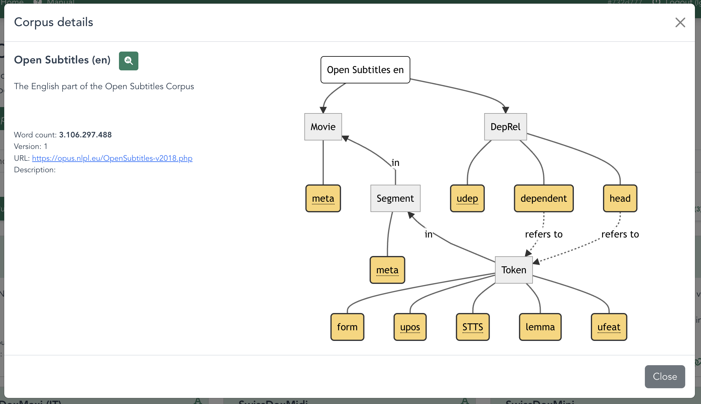

# Corpora in LCP

In LCP corpora is modeled as connected layers: at least three layers must represent (i) ordered units, (ii) ordered collections of said units, and (iii) unordered collections of the latter.

Layers can have any number of attributes for annotation purposes, and corpus authors can define additional layers to model further embedding or dependency relations.

The diagram in the figure below shows the structure of a corpus created from the Open Subtitles database, that anotates tokens (layer i) with a form, a lemma and part-of-speech, groups them as a segments (sentences, layer ii) which are themselves contained in movies (layer iii); a paralel layer models the dependency relations between tokens.

A [simple command-line interface](lcp_cli.md) allows users to submit corpora to LCP as standard TSV tables along with JSON metadata (for their either private or public use).
